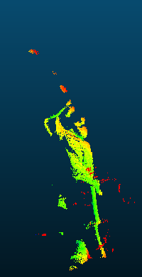

# Computer Vision and Applications Final Project

Project Executable

The precompiled executable and all of the required dependencies are located in bin/FinalProject.exe, and the output file of the point cloud will be at output/吳宇昕_m11225013.txt.

Output and Comparison Against the Ground Truth

Here are some images showing the colored output point cloud and how much the predicted points deviate from the ground truth. The comparison images are generated using CloudCompare, with color green representing close proximity to ground truth and red representing large deviation. Any deviation value above 5 unit length is shown red.

    
    
    

  
    Figure1.
  
  
    Left, front and top view of the colored output point cloud. 
  

    
    
    

    
      Figure2.
    
    
      Left, front and top view of the output point cloud compared against the ground truth. Distance above 5 unit length is saturated to color red.
    

  Generating Blue Scan Line Mask

My method of generating blue scan line mask has been proven quite ineffective. Most of pixels of the blue scan lines in the darker regions of the model, such as where its hat is, were not captured and as a result, the predicted 3D model is missing its hat. Also, there are a lot of noise around the predicted model floating around not being filtered.

The blue pixel mask I created for each scan image is an intersection between three independent masks: <b>time difference mask</b>, <b>blue channel value mask</b> and <b>scanned object RoI mask</b>.
* Time difference mask: the mask created by calculating the blue pixel value differences between the two sets of scan images. The blue scan line is pretty obvious in this mask but it is also quite thick. This mask also contains some large areas of unwanted white region since the light of the scanning environment moves and shifts the shadow of the model.
* Blue channel value mask: this mask assumes all of the pixels within a scan image are on the blue scan line if their blue pixel values are $k$ times larger than both their red value and green value, where $k$ is a predefined value hard-coded into the program. This mask contains a lot of smaller area of noise scattered all over the place since some darker pixels with near-zero red and green pixel values might be falsely identified as blue.
* Scanned object RoI mask: a predefined rectangular mask hard-coded into the program that covers the scanned object. This mask is used due to desperation.

The blue scan line mask I used is created by performing a <b>bitwise_and</b> operation with <b>time difference mask</b>, <b>blue channel value mask</b> and <b>scanned object RoI mask</b>, with an eye to combining the advantages of the two masks and generate one blue scan line mask to robustly capture the scan line. It didn't work well.

  Rejecting Outliner

After finding a matching feature point in the right image along the epipolar line, the potentially matching feature point is further validated by comparing its surrounding rectangular region against the corresponding region in the left image using template matching. If the score is above a predefined constant, this pair of potentially matching feature point is used for direct triangulation and determine a 3D point. If not, this pair of feature points is ignored.

But even with the aforementioned mechanisim of rejecting outliners, still there is a significant amount of mis-matched pairs of feature points. These rogue feature point pairs are usually projected into some absurd 3D coordinates very far away from the model. And unfortunately I have to use yet another predefined 3D rectangular box with hard-coded dimensions to filter these misprojected 3D points. Any 3D points outside of the predefined box is neglected and will not be written to the point cloud file.

I have tried to determine outliners from the standard deviation and mean value of their coordinates, rejecting 3D points at some times of standard deviation away from the mean coordinate. But this method also wasn't effective enough.

  Conclusion

Unfortunately I wasn't able to reconstruct a good-looking 3D model from the stero images for this final project even with this many pre-defined parameters. The main issue was probably with the unreliable blue scan line mask. Both failing to capture the blue pixels at darker regions and allowing too many undesired noise be falsly identified as the blue pixel on the scan line are the prominant issues that led to further problems rejecting outliners. But for the time being, this is the best outcome I was able to provide and I would absolutly love to learn how to improve my results.