

# Computer Vision and Applications Midterm Project

Project Executable

The precompiled executable and all of the required dependencies are located in build/MidtermProject.exe, and the output xyz file will be at build/output/吳宇昕_m11225013.xyz.

  Output Compared to Ground Truth

  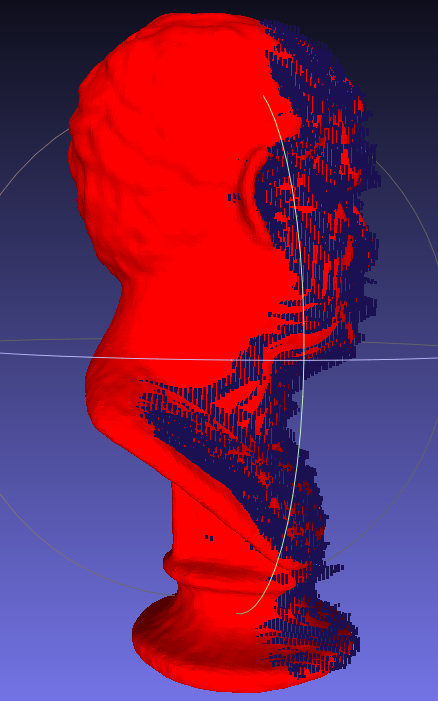
  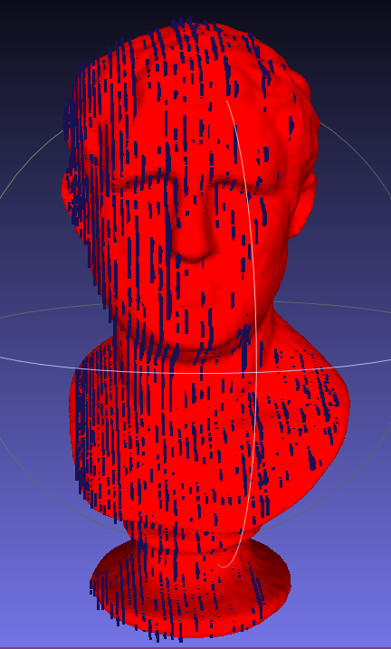
  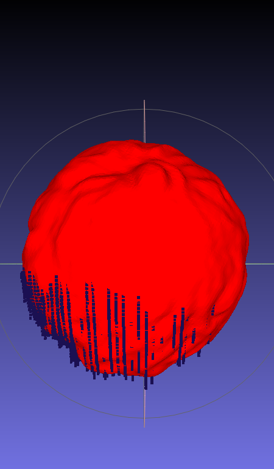

  
    Figure1.
  
  
    Left, front and top view of the sculpture ground truth(red) and the output point cloud(blue). 
  

The red solid mesh is the ground truth provided by professor and the blue points are the predicted sculpture surface generated from the scan images. The blue points generally follow the sculpture surface but there is quite a lot of extras.

  Image Processing Procedure

  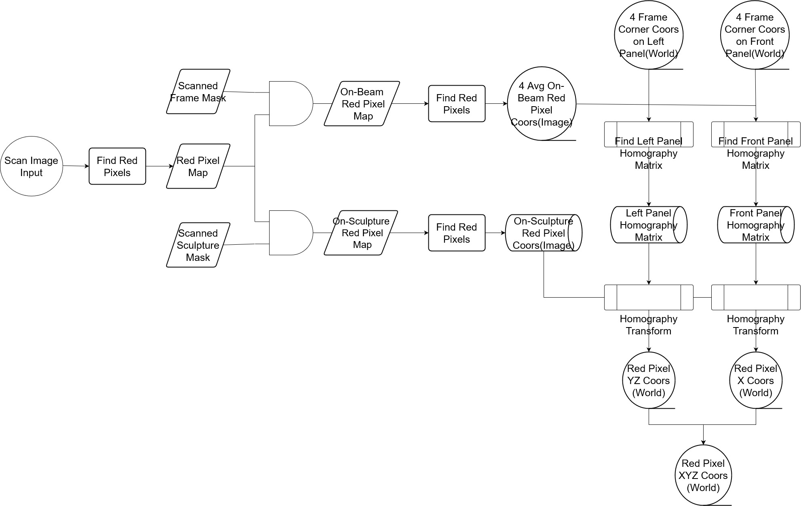

  
    Figure2.
  
  
    Flow chart of predicting the world coordinates of the red pixels in individual scan images.
  

The process of determining the red pixels' world coordinates from scan images is composed of the following major steps:

  <ol style="margin-left:4%; margin-right:4%">
    <li>
      <b>Genterate red pixel map</b>: binarize the scan image so all of the red pixels in the scan image becomes true and everything else becomes false.
      <table style="margin-left:5%">
        <tr>
          <th>Input</th>
          <th>Output</th>
        </tr>
        <tr>
          <td>
            <ul>
              <li>Scan image</li>
              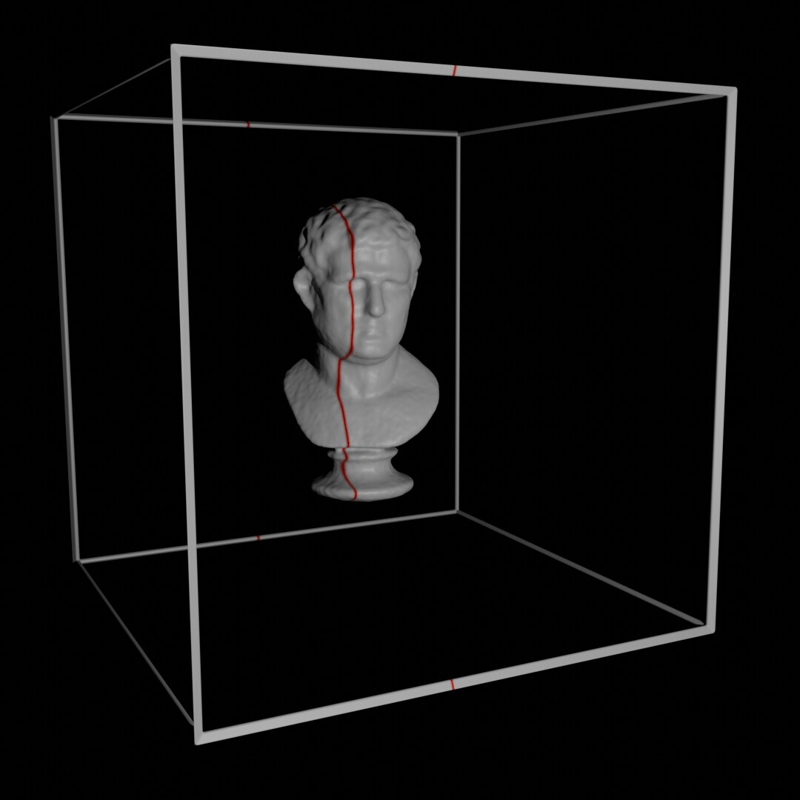
            </ul>
          </td>
          <td>
            <ul>
              <li>Red pixel map</li>
              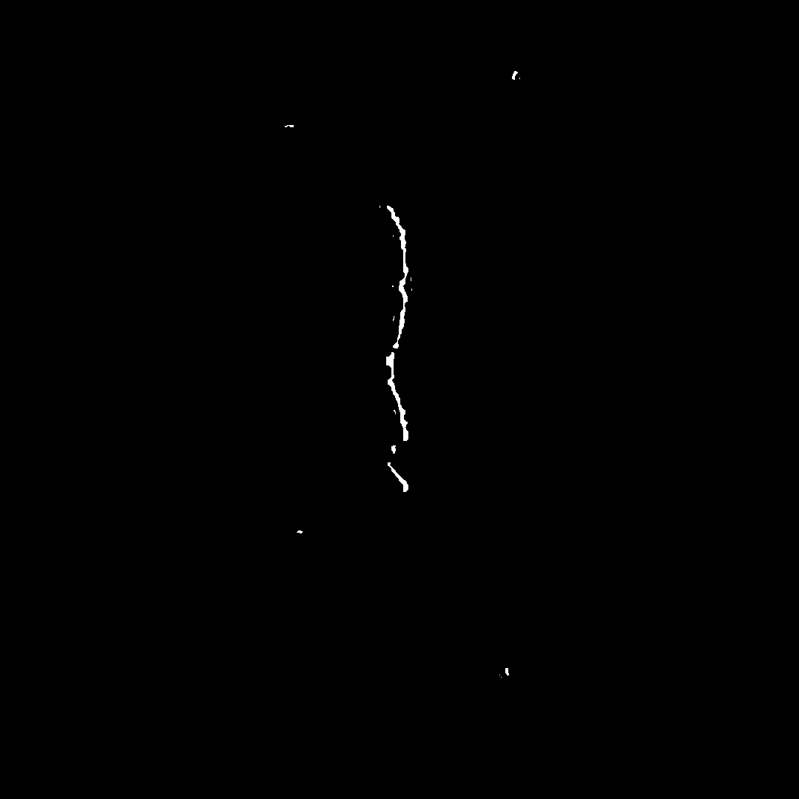
            </ul>
          </td>
        </tr>
      </table>
    </li>
    <li>
      <b>Masking</b>: Most of the essential image masks are created using binary image boolean operations at program run time. By avoiding usage of predefined parameters the flexibility of the program can be increased. The following is some important image masks used and how they are created.
      <ol style="padding-top:5pt">
        <li>Foreground Mask: All of the pixels that belong to both the sculpture and the cubic scanning frame are true, and false everywhere else.
        </li>
          <table style="margin-left:5%">
            <tr>
              <th>Input</th>
              <th>Logical OR</th>
            </tr>
            <tr>
              <tr>
                <td width=150pt>
                  All of the scan images binarized using simple gray level thresholding.
                </td>
                <td>
                  Foreground mask 
                  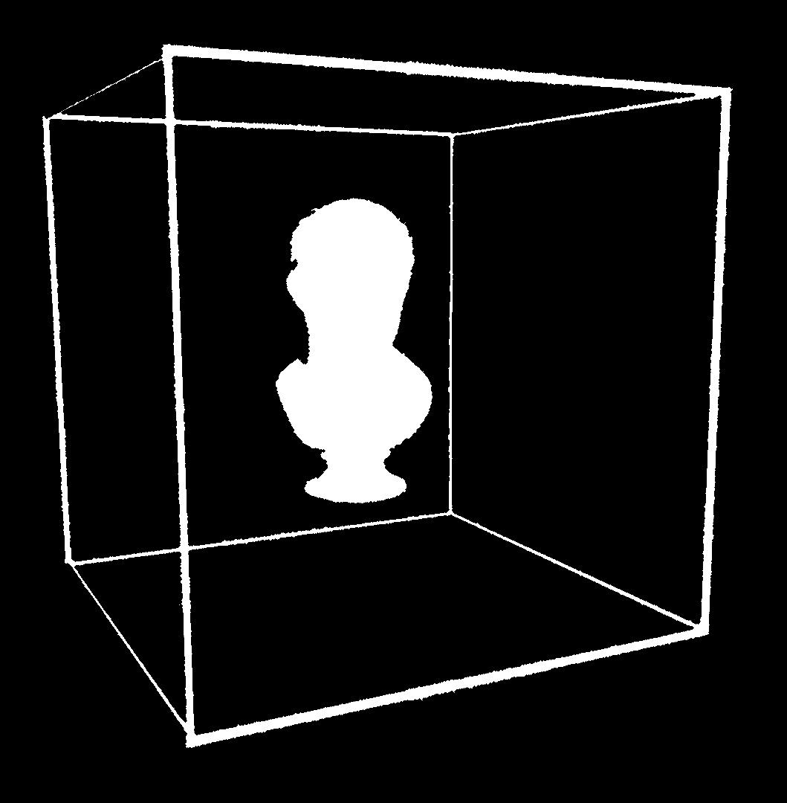
                </td>
              </tr>
            </tr>
          </table>
        <li>Sculpture Area Mask: A predefined rectangular area bounding where the sculpture is in each scan image.
        </li>
          <table style="margin-left:5%">
            <tr>
              <th>Input</th>
              <th>Predefined Region</th>
            </tr>
            <tr>
              <td width=150pt>
                Coordinates of the 4 predefined corners bounding the region in image coordiante system.
              </td>
              <td>
                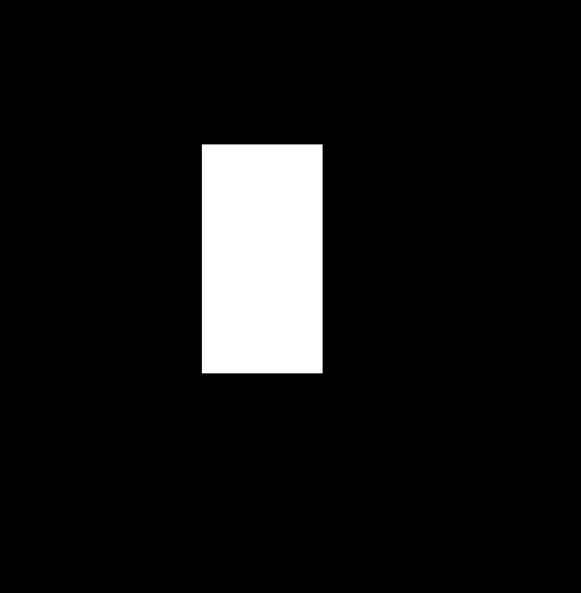
              </td>
            </tr>
          </table>
        <li>Scanned Area Mask: A binary image in which all the red pixles in all of the scan images combined is true, and everywhere else that the red pixels don't reach is false.
        </li>
          <table style="margin-left:5%">
            <tr>
              <th>Input</th>
              <th>Logical OR</th>
            </tr>
            <tr>
              <td>
                All red pixel map from all scan images. 
                
              </td>
              <td>
                Scanned Area Mask 
                
              </td>
            </tr>
          </table>
        <li>Scanned Frame Mask: A binary image in which all of the red pixels on the cubic scanning frame beams in all of the scan images combined are true, and false everywhere else.
        </li>
          <table style="margin-left:5%">
            <tr>
              <th>Input</th>
              <th>Logical NOT</th>
            </tr>
            <tr>
              <td width=200pt>
                <ul>
                  <li>
                    Scanned Area Mask 
                    
                  </li>
                  <li>
                    Sculpture Area Mask 
                    
                  </li>
                </ul>
              </td>
              <td>
                Scanned Frame Mask 
                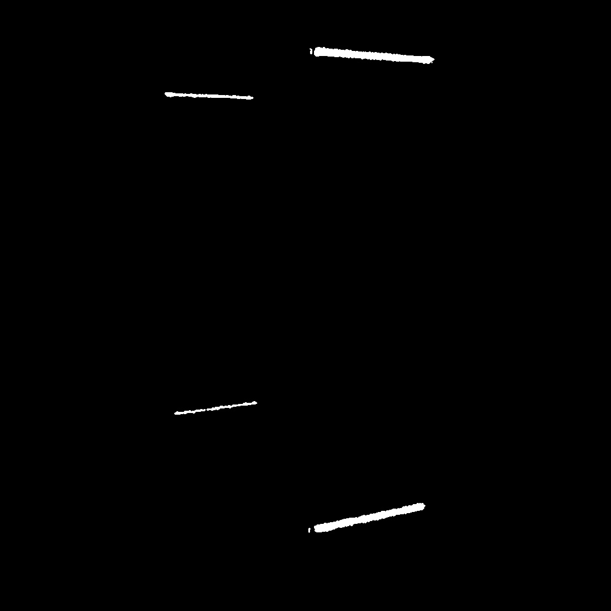
              </td>
            </tr>
          </table>
        <li>Scanned Sculpture Mask: A binary image in which all of the red pixels on the sculpture in all of the scan images combined are true, and false everywhere else.
          <table style="margin-left:5%">
            <tr>
              <th>Input</th>
              <th>Logical AND</th>
            </tr>
            <tr>
              <td width=200pt>
                <ul>
                  <li>
                    Scanned Area Mask 
                    
                  </li>
                  <li>
                    Sculpture Area Mask 
                    
                  </li>
                </ul>
              </td>
              <td>
                Scanned Sculpture Mask 
                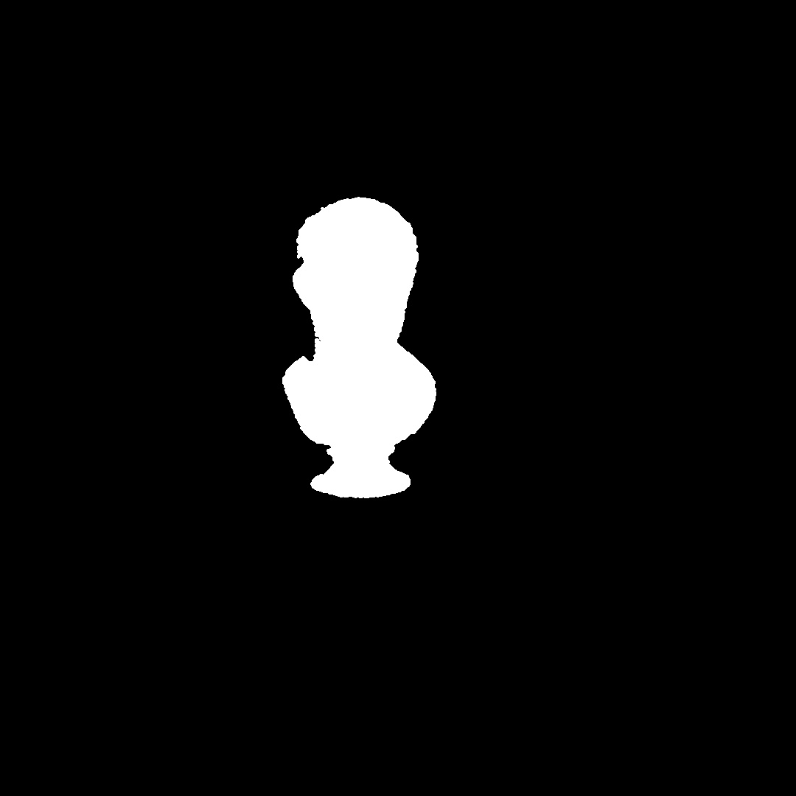
              </td>
            </tr>
          </table>
        </li>
        <li>Sculpture Red Pixel Map: A binary image in which the red pixels on the sculpture in a scan image are true, and false everywhere else. Equivalent to the red pixel map of a scan image excluding the red pixels on scanning frame beams.
          <table style="margin-left:5%">
            <tr>
              <th>Input</th>
              <th>Logical AND</th>
            </tr>
            <tr>
              <td width=200pt>
                <ul>
                  <li>Red Pixel Map 
                    
                  </li>
                  <li>Scanned Sculpture Mask 
                    
                  </li>
                </ul>
              </td>
              <td>
                Sculpture red pixel map 
                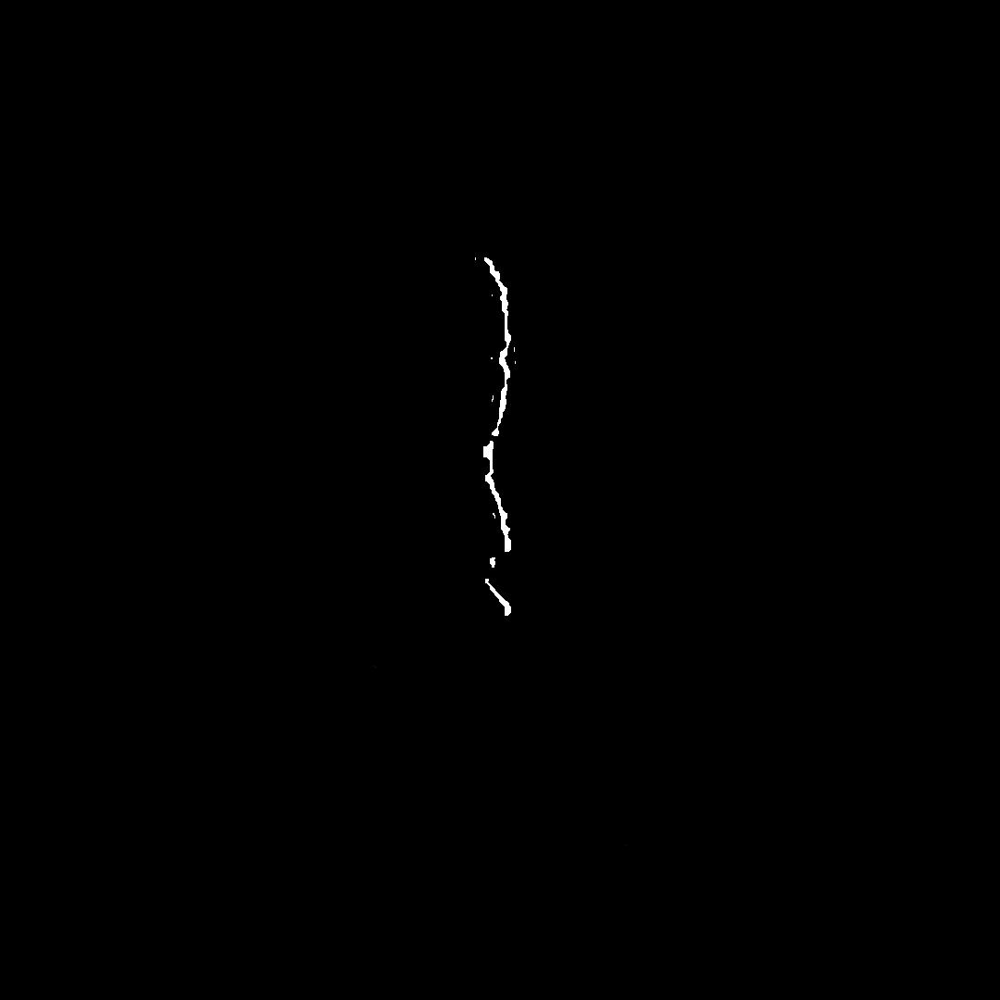
              </td>
              </td>
            </tr>
          </table>
        </li>
        <li> On-Beam Red Pixel Map: A binary image where the red pixels on the cubic scanning frame beams in a scan image are true, and false everywhere else. Equivalent to the red pixel map of a scan image excluding the red pixels on sculpture.
          <table style="margin-left:5%">
            <tr>
              <th>Input</th>
              <th>Logical AND</th>
            </tr>
            <tr>
              <td width=200pt>
                <ul>
                  <li>Red pixel map 
                    
                  </li>
                  <li>Scanned frame mask 
                    
                  </li>
                </ul>
              </td>
              <td>
                On-beam red pixel map 
                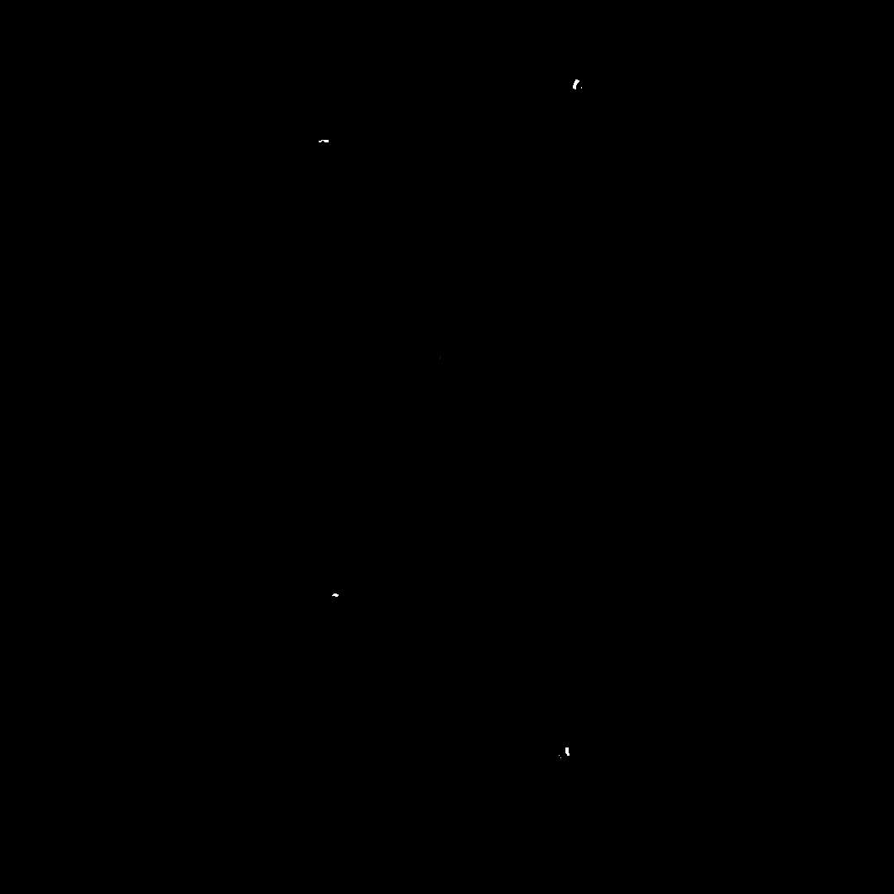
              </td>
              </td>
            </tr>
          </li>
        </table>
      </ol>
    </li>
    <li>
      <b>Find world X coordiantes from front panel homography transform</b>: the front panel is defined as the face of the cubic scan frame closest to the camera and parallel to the world XZ plane in the scan images. 
      

        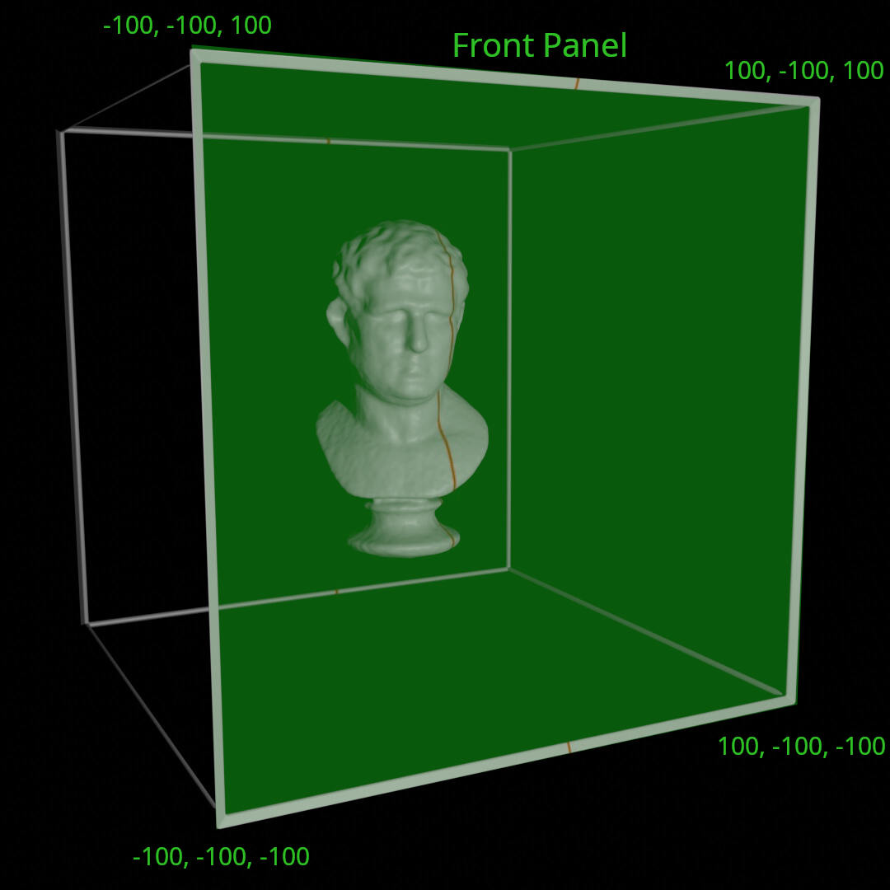
        

          Figure3.
          
            The face of the cubic scan frame highlighted in green shades the front panel. World coordinate of each front panel corner is as shown.
          
        

      

      Since all 4 world coordinates of the front panel corners are given, homography can be used to eliminate perspective effect, remapping the pixels onto another plane as if the camera is pointing to the center of the front panel orthogonally.
      

        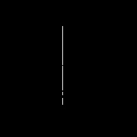
        

          Figure4.
          
            Red pixel map of a scan image after applying front panel homography transform.
          
        

      

      All of the red pixels from a given scan image shares the same world x coordinate since the red scanning plane is parallel to the world YZ plane and translates along the world x axis. Therefore, by finding the average world x coordinate of the red pixels on the frame beams in a scan image, the world x coordinates  of all the other red pixels in the scan image can be determined.
      <table style="margin-left:5%">
        <tr>
          <th>Input</th>
          <th>Output</th>
        </tr>
        <tr>
          <td>
            
          </td>
          <td>
            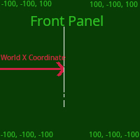
          </td>
        </tr>
      </table>
      The front panel homography matrix is not scan image-specific, so all of the scan images can share the same front panel homography matrix to reproject their red pixels' coordiantes on frame beams to find their world X coordinates.
    </li>
    <li>
      <b>Find world YZ coordiantes from scanning plane homography transform</b>: the left panel is defined as the face of the cubic scanning frame closest to the camera and parallel to the world YZ plane in the scan images. The scanning plane, parallel to the left panel, slices through the sculpture and the cubic scanning frame, casting red shadows on 4 of the horizontal beams in each scan image.
      

        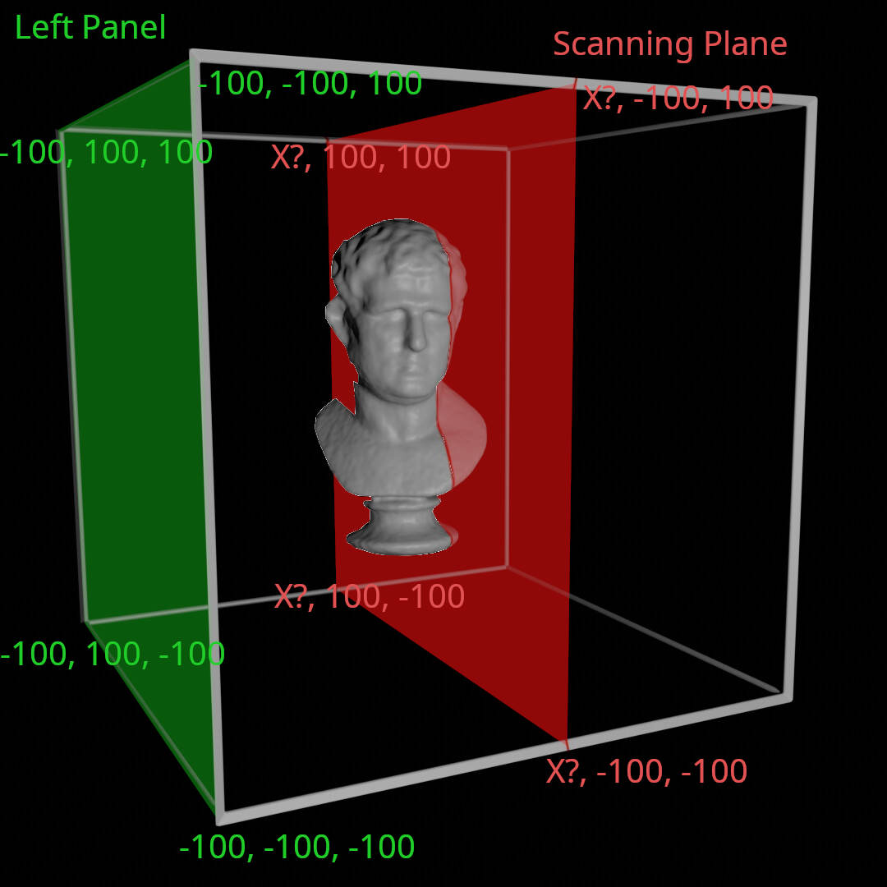
        

          Figure5.
           
            The face of the cubic scan frame highlighted in green shades the left panel while the red plane is the scanning surface. World coordinates of the 4 corners are as shown and the world YZ coordinates of the red pixels on beams are same as their coresponding scanning frame corners.
        

      

      The on-beam red pixels share the same world YZ coordinate with their cooresponding corners on the left panel. Using the 4 average coordinates of the red pixels on the 4 beams in the scan image coordinate system and their world YZ coordinate component in world coordinate system, a homography martrix can be determined. Such a homography matrix can transform the scanning plane such that the scanning plane becomes perpendicular to the camera's optical axis and its center aligns with the camera's optical axis. The resulting image looks as if the camera is repositioned to the left side of the scanning frame with its optical axis perpendicular to the the scanning plane, and took a photo using orthogonal projection, eliminating perspective effect.
       
      

        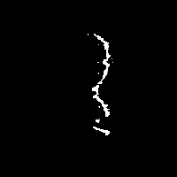
        

          Figure6.
          The scanning plane after homography transform.
        

      

      <table style="margin-left:5%">
        <tr>
          <th>Input</th>
          <th>Output</th>
        </tr>
        <tr>
          <td>
            <ul>
              <li>World coordinate of on-beam red pixels</li>
              <li>Image coordinate of on-beam red pixels</li>
              <li>Sculpture red pixel map 
              
            </ul>
          </td>
          <td>YZ component of the red pixels' world coordinate. 
          Reprojected scanning plane
          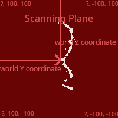
          </td>
        </tr>
      </table>
    </li>
    <li>Export Point Cloud As Xyz File: Combine the world XYZ coordinates found using the methods explained for all of the red pixels on sculpture and write their world coordinates into an XYZ file.
    </li>
  </ol>

  

    Final Thoughts
  

  

    We have learned a lot about homography from this midterm project. The project simulates a 3D scanning procedure in a pretty ideal environment in which little to no background interference is involved, camera follows ideal pinhole model, lighting conditions are stable and scanned object remains absolutely stationary. Despite these super-optimistic assumptions, the result of the predicted sculpture surface is still sub-optimal.
  

  

    In any case, it's quite amazing how powerful homography transform is in computer vision. We have learned a lot about homography in this project. I personally use to think that the procedure of reconstructing a 3D model from 2D images would be too convoluted for us to understand. In fact, I do still think it is pretty complicated and requires a lot of brainstorming. But after finishing this project, it is clear that it is more about math and programming than magic.
  

